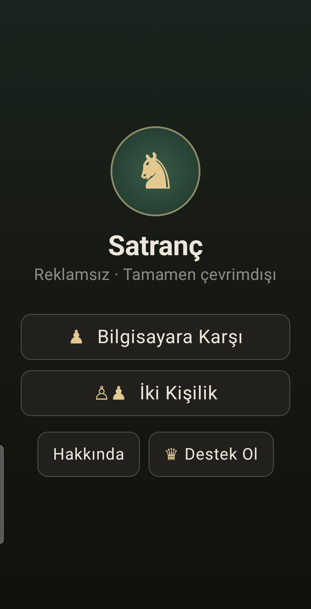
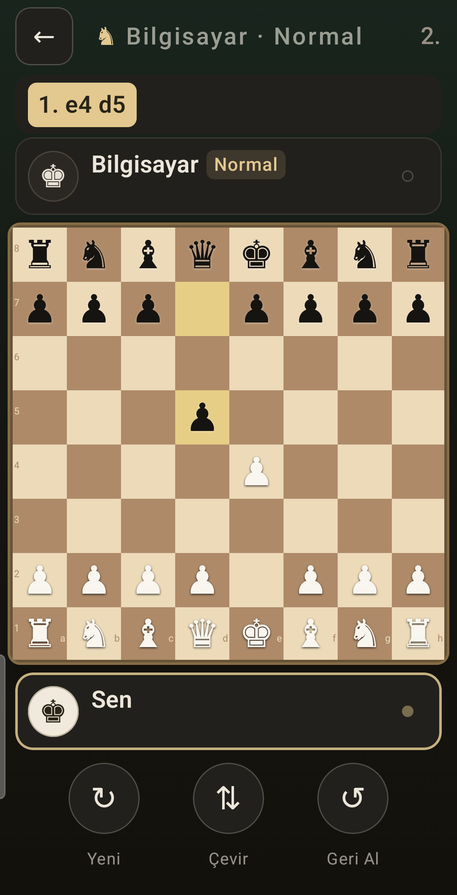
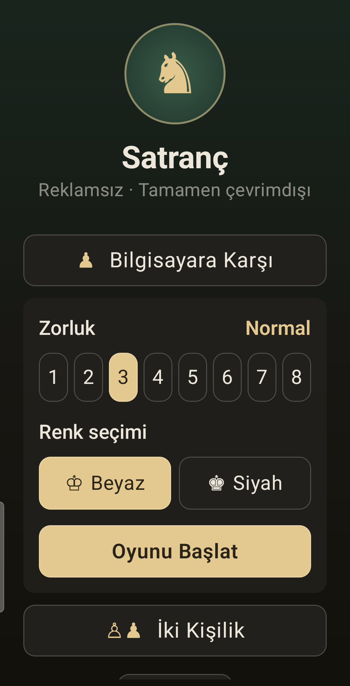
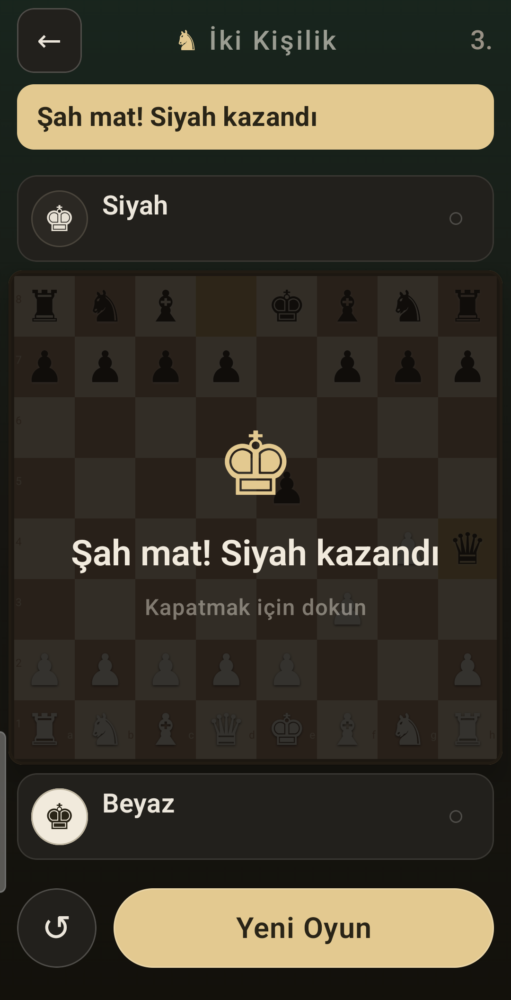
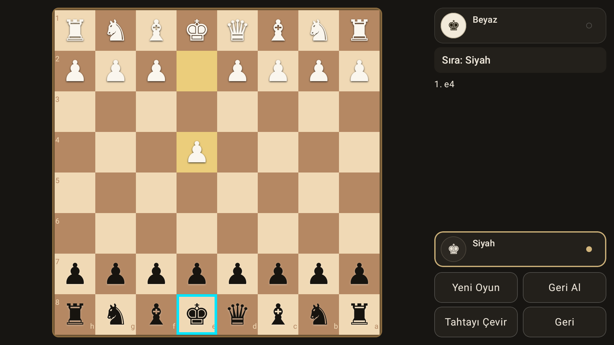

<div align="center">


# Chess · Satranç

**Ad-free, tracker-free, fully offline chess for Android phones, tablets and TV.**

[](LICENSE)
[](#building)
[](https://github.com/official-stockfish/Stockfish)

[English](#english) · [Türkçe](#türkçe)

</div>

---

## English

No ads. No subscriptions. No locked features. No account. No analytics. The
computer opponent runs entirely on your device, so the game needs no internet
connection at all.

One codebase runs on phones, tablets and Android TV (with full D-pad support).

> This started as a personal project out of frustration with how ad-heavy the
> chess games on the Play Store are.

### Screenshots

| Main menu | Playing | Difficulty |
|:---:|:---:|:---:|
|  |  |  |

| Checkmate | Android TV |
|:---:|:---:|
|  |  |

<sub>Screenshots were captured with the Turkish interface. The app ships in
English and Turkish and follows your device language.</sub>

### Features

- **Play vs Computer** — Stockfish 17.1 with 8 difficulty levels (Beginner →
  Grandmaster). The lower levels deliberately cap search depth, so the engine
  genuinely blunders and hangs pieces instead of being unbeatable-or-nothing.
  Defaults to Normal.
- **Two players** — face to face on one device. On TV the board turns to
  whoever is to move and the cursor jumps to their side; on phones and tablets
  the board stays put, since the device usually lies flat between players.
- Player cards with captured pieces, material advantage, turn and check
  indicators
- Move list in SAN, undo, board flip, promotion picker
- Check, checkmate, stalemate and draw detection with an end-of-game overlay
- Phone layout is bottom-weighted so the whole game is reachable one-handed
- English and Turkish, with a per-app language picker on Android 13+

### Privacy

No account, no data collection, nothing about your game ever leaves the device.

The manifest does declare `INTERNET` and `ACCESS_NETWORK_STATE`, but only
because the Play Billing library adds them for the optional support screen. The
game itself never opens a socket. See the
[privacy policy](https://nacikoc.github.io/chess/privacy.html).

### Architecture

- **UI** — Kotlin + Jetpack Compose (Material 3)
  - Portrait: board and player cards sit low; the variable extra height on
    different devices collapses into a single flexible band, and the controls
    live in a rounded dock within thumb reach.
  - Landscape (TV/tablet): board left, side panel right.
  - `FocusButton` makes D-pad focus unmistakable — cyan border plus scale.
- **Rules** — [chesslib](https://github.com/bhlangonijr/chesslib) handles move
  generation, castling, en passant, promotion and all draw conditions.
- **Engine** (`engine/`)
  - `StockfishEngine` runs Stockfish as a **separate OS process** and talks to
    it over stdin/stdout using the UCI protocol. Difficulty maps to Skill Level
    plus a search limit.
  - `BuiltInEngine` is a Kotlin alpha-beta fallback used on ABIs that ship no
    Stockfish binary (x86_64 emulators, Chromebooks).
  - `EngineFactory` picks between them at runtime.

The Stockfish binary is packaged as `jniLibs/<abi>/libstockfish.so`. Despite the
name it is an executable, not a library — the `lib*.so` naming is what makes
Android extract it to `nativeLibraryDir` with the executable bit set, and
`useLegacyPackaging = true` keeps it uncompressed on disk so it can be run.

### Building

```bash
gradlew.bat :app:assembleDebug
```

APKs land in `app/build/outputs/apk/debug/` (arm64-v8a, armeabi-v7a, x86_64).

```bash
adb install -r app/build/outputs/apk/debug/app-arm64-v8a-debug.apk
```

Requires JDK 21 and the Android SDK (compileSdk 36). minSdk is 26 (Android 8.0).
For release builds and Play publishing see [RELEASING.md](RELEASING.md) and
[docs/play-console-yukleme.md](docs/play-console-yukleme.md).

**Rebuilding Stockfish.** The bundled binaries are not the official releases —
those are 4 KB page-aligned and Play rejects them for apps targeting Android
15+. They were rebuilt from unmodified Stockfish 17.1 source with
`-Wl,-z,max-page-size=16384`. The exact procedure is
[`tools/build-stockfish.sh`](tools/build-stockfish.sh), and
[`tools/check-16kb.sh`](tools/check-16kb.sh) verifies alignment of every native
library in an APK or AAB.

### License

This program is free software: you can redistribute it and/or modify it under
the terms of the GNU General Public License as published by the Free Software
Foundation, either version 3 of the License, or (at your option) any later
version. Full text in [LICENSE](LICENSE).

The app bundles **Stockfish**, which is GPLv3, and is released under GPLv3 as a
whole. The corresponding source for the bundled engine binaries is unmodified
[Stockfish 17.1](https://github.com/official-stockfish/Stockfish) built with the
script above. Other components and their licenses are listed in
[THIRD-PARTY.md](THIRD-PARTY.md).

This program is distributed in the hope that it will be useful, but WITHOUT ANY
WARRANTY; without even the implied warranty of MERCHANTABILITY or FITNESS FOR A
PARTICULAR PURPOSE.

### Contact

Built by **Naci Koç** — <nakisoft@gmail.com> · package `com.hilspot.chess`

Bug reports and suggestions are welcome via
[issues](https://github.com/nacikoc/chess/issues).

---

## Türkçe

Reklam yok, abonelik yok, kilitli özellik yok, hesap yok, analitik yok.
Bilgisayar rakip tamamen cihazında çalışır; oyun için internet bağlantısı hiç
gerekmez.

Tek kod tabanı telefon, tablet ve Android TV'de (tam D-pad desteğiyle) çalışır.

> Bu proje, Play Store'daki satranç oyunlarının reklam yoğunluğundan rahatsız
> olup "reklamsız olsun" diye başlanmış kişisel bir çalışmadır.

### Ekran görüntüleri

| Ana menü | Oyun | Zorluk seçimi |
|:---:|:---:|:---:|
|  |  |  |

| Mat | Android TV |
|:---:|:---:|
|  |  |

### Özellikler

- **Bilgisayara karşı** — Stockfish 17.1, 8 zorluk seviyesi (Acemi →
  Büyükusta). Alt seviyelerde arama derinliği kasıtlı olarak sınırlandırıldı;
  böylece motor gerçekten hata yapar, taş sarkıtır ve sıradan bir oyuncu
  tarafından yenilebilir. Varsayılan seviye: Normal.
- **İki kişilik** — aynı cihazda karşılıklı oyun. TV'de tahta her hamlede
  sırası gelen oyuncuya döner ve imleç onun tarafına atlar; telefon ve tablette
  tahta sabit kalır, çünkü cihaz genelde iki oyuncunun arasına düz konur.
- Oyuncu kartları: alınan taşlar, materyal farkı, sıra ve şah göstergesi
- SAN hamle listesi, geri alma, tahta çevirme, terfi seçimi
- Şah / mat / pat / beraberlik tespiti ve oyun sonu perdesi
- Telefon düzeni alta yaslı: oyunun tamamı tek elle oynanabilir
- İngilizce ve Türkçe; Android 13+'te uygulama içi dil seçimi

### Gizlilik

Hesap yok, veri toplanmıyor, oyununa dair hiçbir şey cihazdan çıkmıyor.

Manifest'te `INTERNET` ve `ACCESS_NETWORK_STATE` izinleri görünür, ama bunun
tek sebebi Play Billing kütüphanesinin isteğe bağlı destek ekranı için bunları
eklemesidir. Oyunun kendisi hiçbir bağlantı açmaz.
[Gizlilik politikası](https://nacikoc.github.io/chess/privacy.html).

### Mimari

- **Arayüz** — Kotlin + Jetpack Compose (Material 3)
  - Dikey düzen: tahta ve oyuncu kartları alta yaslanır; cihazdan cihaza
    değişen fazla yükseklik tek bir esnek banda düşer, kontroller başparmak
    menzilindeki yuvarlak yuvada durur.
  - Yatay düzen (TV/tablet): tahta solda, panel sağda.
  - `FocusButton` D-pad odağını belirgin gösterir — camgöbeği çerçeve ve büyüme.
- **Kurallar** — [chesslib](https://github.com/bhlangonijr/chesslib): hamle
  üretimi, rok, en passant, terfi ve tüm beraberlik koşulları.
- **Motor** (`engine/`)
  - `StockfishEngine`, Stockfish'i **ayrı bir işletim sistemi süreci** olarak
    çalıştırır ve stdin/stdout üzerinden UCI protokolüyle konuşur. Zorluk =
    Skill Level + arama sınırı.
  - `BuiltInEngine`, Stockfish binary'si paketlenmemiş ABI'larda (x86_64
    emülatör, Chromebook) devreye giren Kotlin alpha-beta motorudur.
  - Seçimi `EngineFactory` çalışma zamanında yapar.

Stockfish binary'si `jniLibs/<abi>/libstockfish.so` olarak paketlenir. Adına
rağmen bu bir kütüphane değil, **çalıştırılabilir bir programdır** — `lib*.so`
adlandırması Android'in onu `nativeLibraryDir`'e çalıştırma iziyle çıkarmasını
sağlar, `useLegacyPackaging = true` ise sıkıştırılmadan diske yazılmasını
garanti eder ki çalıştırılabilsin.

### Derleme

```bash
gradlew.bat :app:assembleDebug
```

APK'lar `app/build/outputs/apk/debug/` altında oluşur (arm64-v8a, armeabi-v7a,
x86_64).

```bash
adb install -r app/build/outputs/apk/debug/app-arm64-v8a-debug.apk
```

JDK 21 ve Android SDK gerekir (compileSdk 36). minSdk 26 (Android 8.0). Yayın
derlemesi ve Play süreci için [RELEASING.md](RELEASING.md) ve
[docs/play-console-yukleme.md](docs/play-console-yukleme.md).

**Stockfish'i yeniden derlemek.** Paketlenen binary'ler resmî sürümler değildir:
resmî Android binary'leri 4 KB sayfa hizalı ve Android 15+ hedefleyen
uygulamalarda Play bunları reddediyor. Değiştirilmemiş Stockfish 17.1
kaynağından `-Wl,-z,max-page-size=16384` ile yeniden derlendiler. Birebir
prosedür [`tools/build-stockfish.sh`](tools/build-stockfish.sh) dosyasında;
[`tools/check-16kb.sh`](tools/check-16kb.sh) ise bir APK veya AAB içindeki tüm
yerel kütüphanelerin hizalamasını denetler.

### Lisans

Bu program özgür yazılımdır: Özgür Yazılım Vakfı tarafından yayımlanan GNU Genel
Kamu Lisansı'nın 3. sürümü (veya tercihinize göre daha sonraki bir sürümü)
koşulları altında yeniden dağıtabilir ve/veya değiştirebilirsiniz. Tam metin:
[LICENSE](LICENSE).

Uygulama GPLv3 lisanslı **Stockfish**'i içerir ve bir bütün olarak GPLv3 ile
dağıtılır. Paketlenen motor binary'lerinin karşılık gelen kaynağı,
yukarıdaki betikle derlenmiş değiştirilmemiş
[Stockfish 17.1](https://github.com/official-stockfish/Stockfish)'dir. Diğer
bileşenler ve lisansları: [THIRD-PARTY.md](THIRD-PARTY.md).

Bu program faydalı olacağı umuduyla dağıtılır, ancak HİÇBİR GARANTİ
VERİLMEZ; SATILABİLİRLİK veya BELİRLİ BİR AMACA UYGUNLUK zımni garantisi dahi
verilmemektedir.

### İletişim

Geliştiren: **Naci Koç** — <nakisoft@gmail.com> · paket adı `com.hilspot.chess`

Hata bildirimi ve önerileriniz için
[issues](https://github.com/nacikoc/chess/issues).
